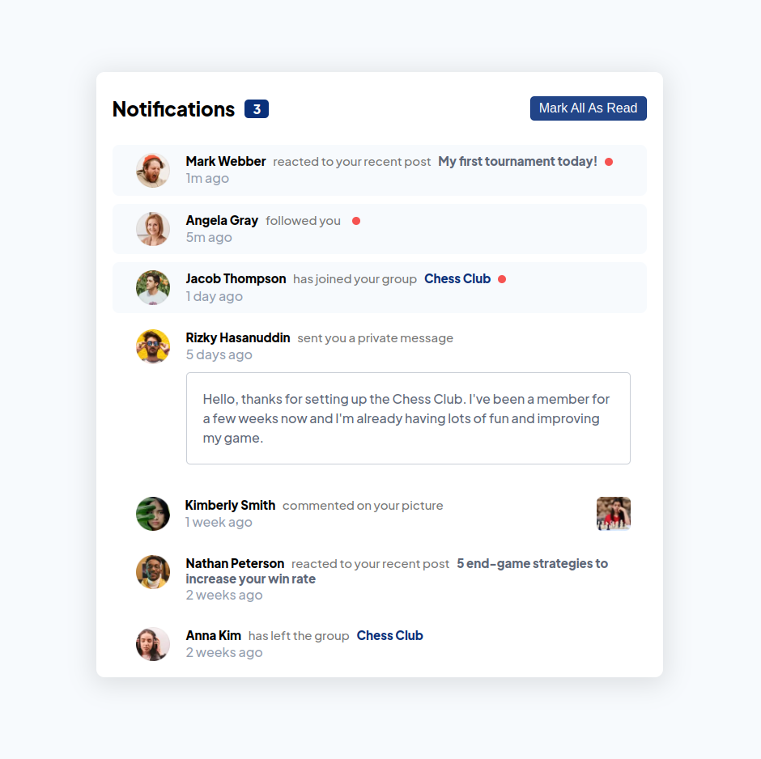
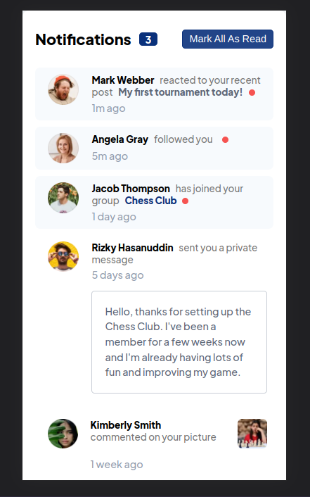

# Frontend Mentor - Notifications page solution

This is a solution to the [Notifications page challenge on Frontend Mentor](https://www.frontendmentor.io/challenges/notifications-page-DqK5QAmKbC).

## Table of contents

-   [Overview](#overview)
    -   [The challenge](#the-challenge)
    -   [Screenshot](#screenshot)
    -   [Links](#links)
-   [My process](#my-process)
    -   [Built with](#built-with)
    -   [What I learned](#what-i-learned)
    -   [Continued development](#continued-development)
    -   [Useful resources](#useful-resources)
-   [Author](#author)
-   [Acknowledgments](#acknowledgments)

## Overview

### The challenge

Users should be able to:

-   Distinguish between "unread" and "read" notifications
-   Select "Mark all as read" to toggle the visual state of the unread notifications and set the number of unread messages to zero
-   View the optimal layout for the interface depending on their device's screen size
-   See hover and focus states for all interactive elements on the page

### Screenshot




### Links

-   Solution URL: [Add solution URL here](https://github.com/amiraiman/fem-noti-page)
-   Live Site URL: [Add live site URL here](https://amiraiman.github.io/fem-noti-page)

## My process

### Built with

-   Semantic HTML5 & CSS3
-   Flexbox
-   CSS Grid
-   Sass
-   Javascript
-   NPM for package management
-   Desktop-first workflow

### What I learned

```html
<h1>Some HTML code I'm proud of</h1>
```

```css
.proud-of-this-css {
    color: papayawhip;
}
```

```js
const proudOfThisFunc = () => {
    console.log("🎉");
};
```

### Continued development

-   Convert to a React Component

### Useful resources

-   [Example resource 1](https://www.example.com) - This helped me for XYZ reason. I really liked this pattern and will use it going forward.
-   [Example resource 2](https://www.example.com) - This is an amazing article which helped me finally understand XYZ. I'd recommend it to anyone still learning this concept.

## Author

-   Github - [Amir Aiman](https://www.github.com/amiraiman)
-   Frontend Mentor - [@amiraiman](https://www.frontendmentor.io/profile/amiraiman)
-   Email - [amiraiman.jj@gmail.com](mailto::amiraiman.jj@gmail.com)

## Acknowledgments
